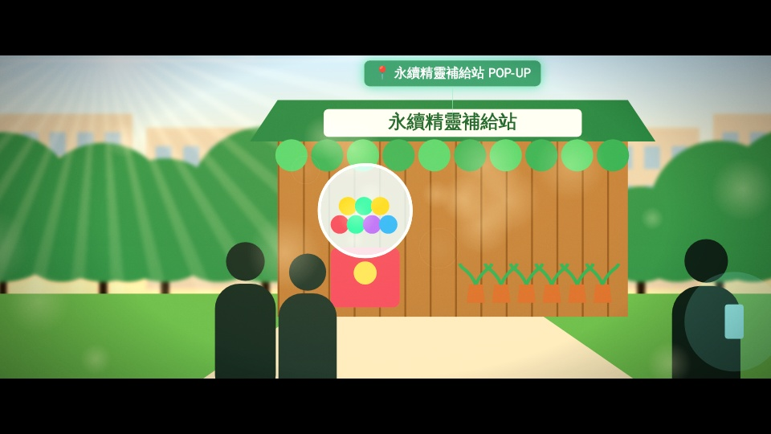
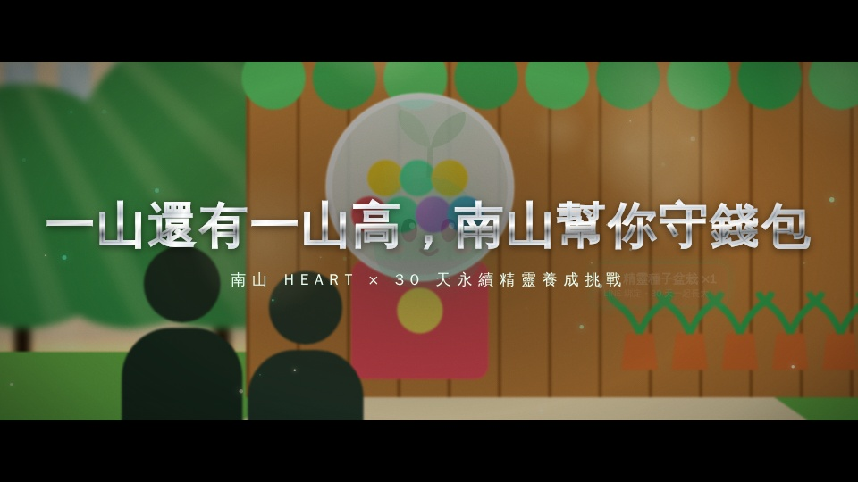
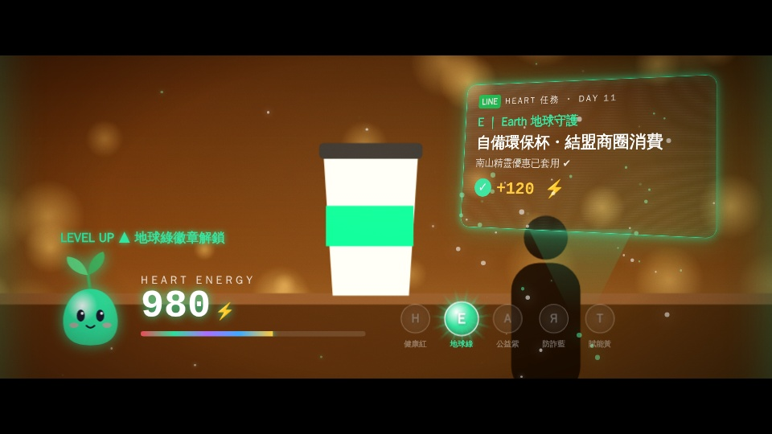
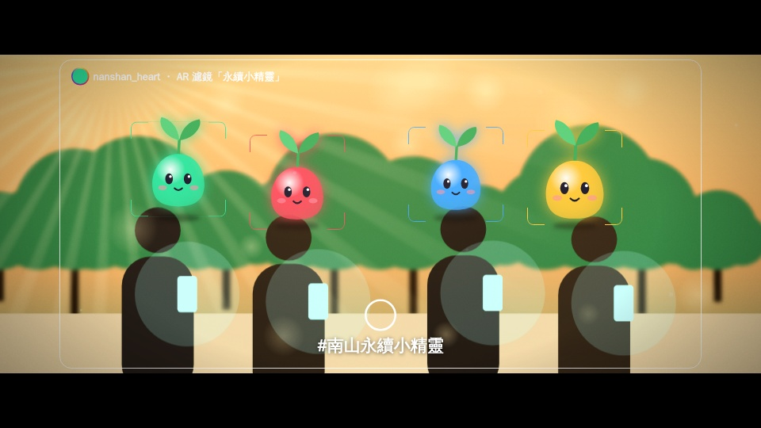
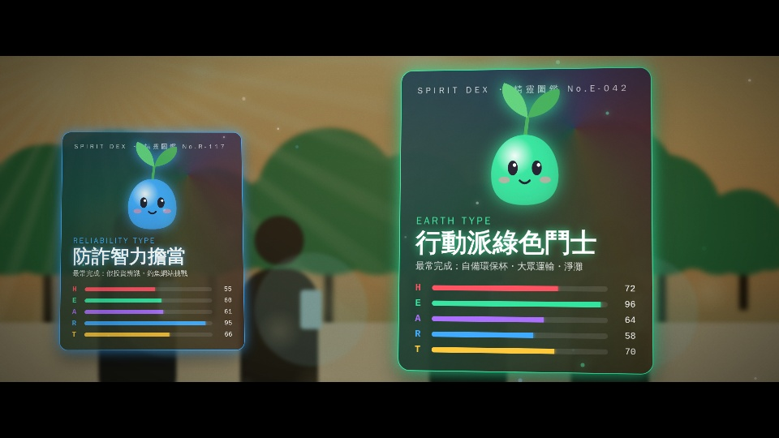
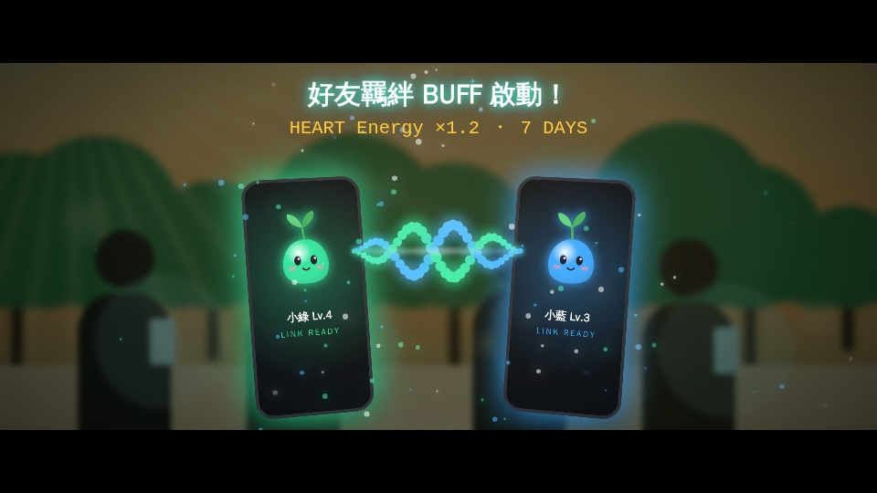
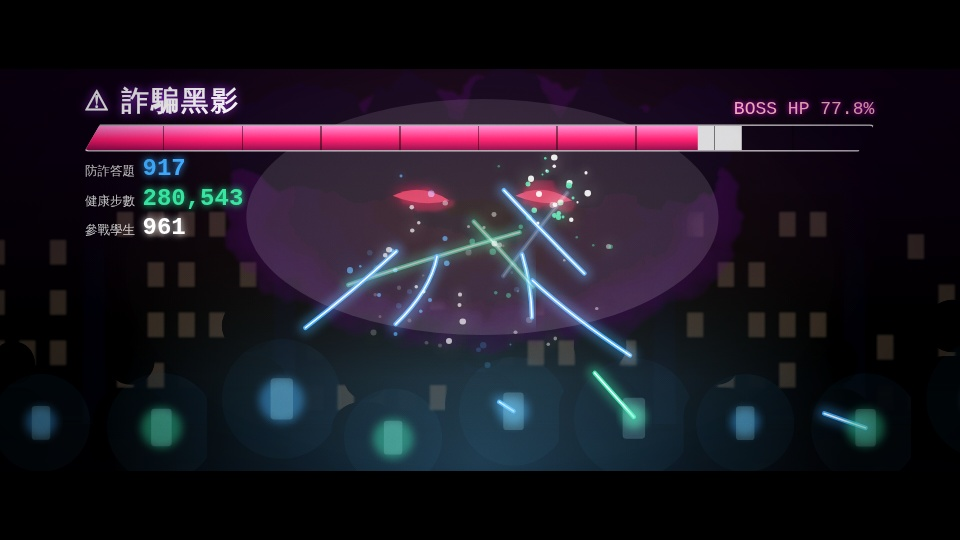
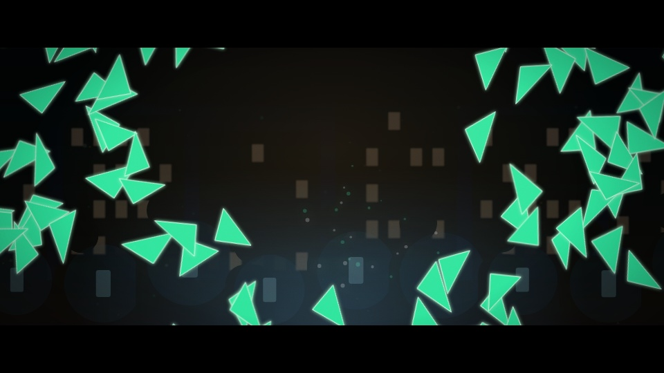
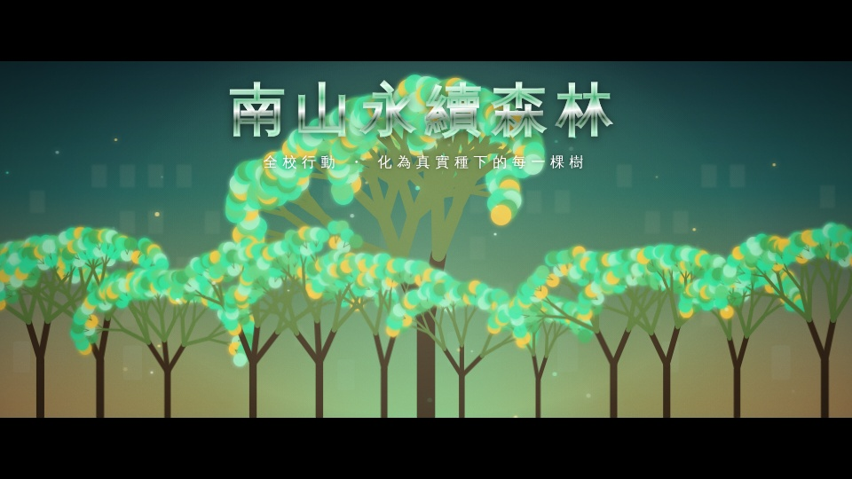
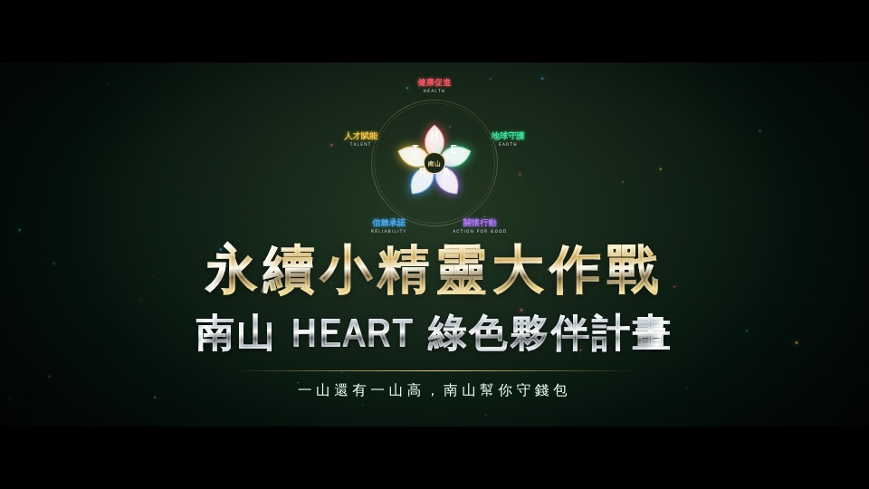

# 南山 HEART 永續精靈 — Cinematic 4K 宣傳影片（Remotion）

依《南山人壽企劃書》製作的 60 秒影片程式：實拍素材 + 3D AR UI 疊加，3840×2160 / 60 FPS。
分鏡腳本見 [`STORYBOARD.md`](./STORYBOARD.md)。

## 快速開始

```bash
npm install
npm run dev            # Remotion Studio 預覽
npm run typecheck
npm run render:preview # 1080p 快速預覽（--scale=0.5）
npm run render         # 4K60 H.264 母帶（CRF 16）
npm run render:prores  # ProRes 4444 調光／剪輯用
```

`NanshanHeartFilm-Review` composition 會加上安全框與時間碼，給導演審片用。

## 架構

```
src/
├─ Root.tsx                 Composition 3840×2160 @60fps, 3600f
├─ NanshanHeartFilm.tsx     5 個 Sequence 串接 + 交叉溶接 + BGM + 電影後製層
├─ config/
│  ├─ timeline.ts           FPS / 場景區間 / XFADE
│  ├─ theme.ts              HEART 五色、字體、標語
│  └─ footage.ts            實拍素材清單（缺檔時自動退回示意實景板）
├─ cinema/
│  ├─ LiveFootage.tsx       <OffthreadVideo>/<Video> + 數位運鏡 + 調色 + CSS mask 遮罩
│  ├─ ProceduralPlate.tsx   程序化示意實景板（pre-viz）
│  └─ CinematicFinish.tsx   2.39:1 遮幅、底片顆粒、暗角、halation、變形鏡頭光斑
├─ ui/                      HoloPanel（3D 全息）、LiquidMetalText（流體金屬字）、
│                           EnergyHUD、MbtiCard、BossHpBar、HeartTotem、Spirit
├─ fx/                      Particles、BeamStorm（光束）、BondLink（羈絆連線）、
│                           ShadowBoss、ShatterForest（碎裂→森林）
└─ scenes/                  Scene1–5
```

### 動畫參數（`src/lib/anim.ts`）

| Spring | damping | stiffness | mass | 用途 |
|---|---|---|---|---|
| holo | 14 | 120 | 0.9 | 全息面板展開（輕微過衝） |
| badge | 9 | 180 | 0.6 | 徽章解鎖回彈 |
| title | 200 | 60 | 1.4 | 電影標題（無過衝） |
| pop | 11 | 220 | 0.7 | 扭蛋／精靈彈出 |
| grow | 26 | 40 | 1.6 | 森林生長 |

所有隨機效果都使用 `random(seed)`，每格結果固定，可平行算圖。

## 算圖注意

- 4K 畫面中 SVG 濾鏡（顆粒、液態置換、光束模糊）用量很重，4 核心機器每格約數秒，建議放到 Remotion Lambda 或多核心機器上算。
- 在沒有對外網路的環境，加上 `--browser-executable=<本機 Chrome Headless Shell 路徑>`。
- 字體：把 Noto Sans TC 放到 `public/fonts/`（`NotoSansTC-Black.otf`、`NotoSansTC-Medium.otf`），沒放時會改用系統字體。

## 預覽（示意實景板，960×540 縮圖）

| | |
|---|---|
|  1A 校園平移 |  1C 流體金屬標語 |
|  2E 全息任務卡 |  3A AR 濾鏡合影 |
|  3B MBTI 圖鑑 |  3C 好友羈絆 |
|  4B Boss 戰光束 |  4C 黑影碎裂 |
|  4D 永續森林 |  5C 品牌定格 |
